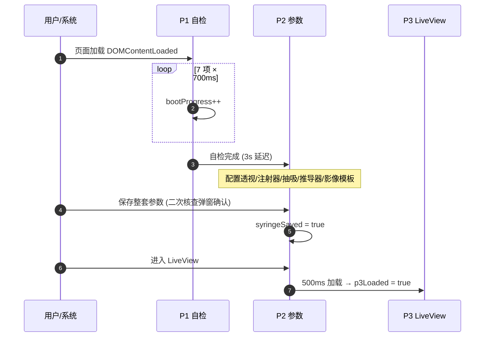
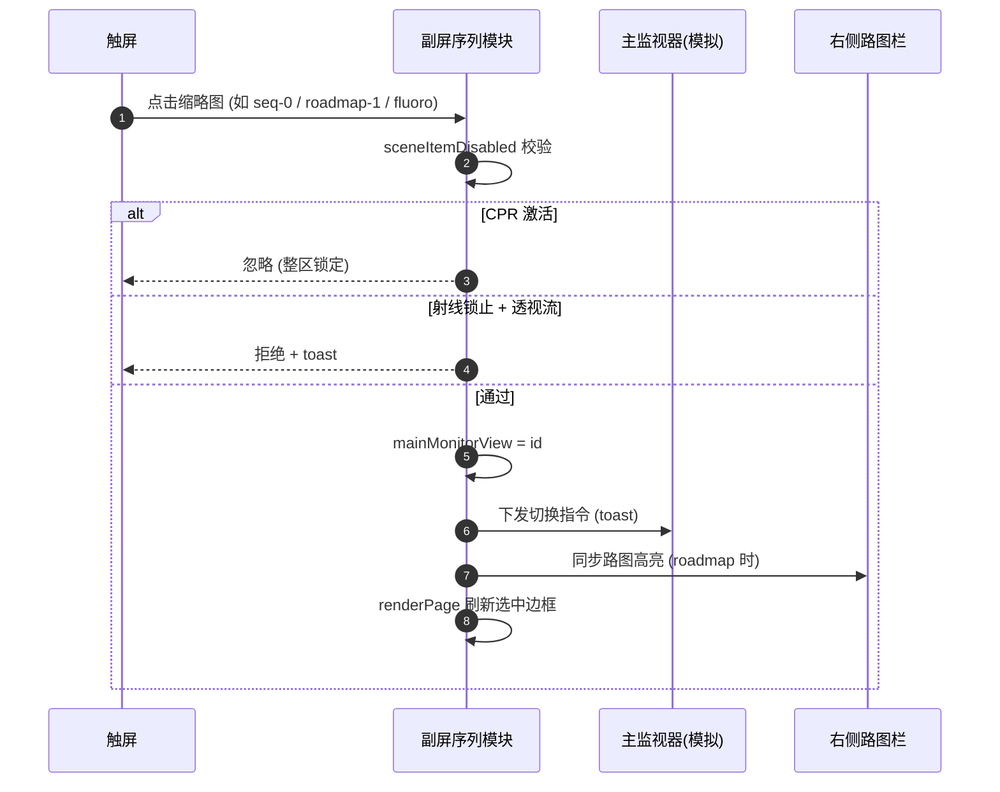
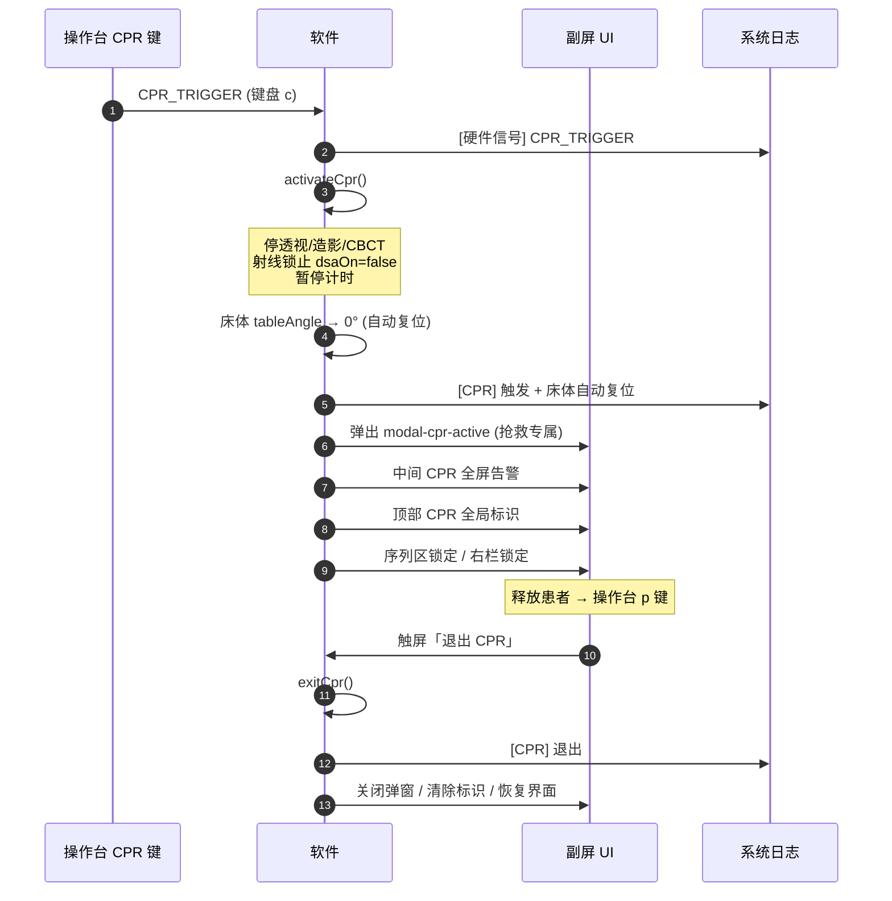
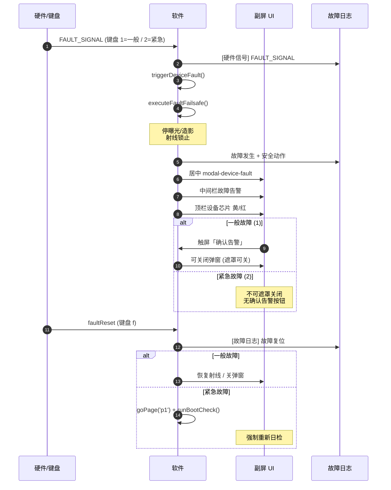
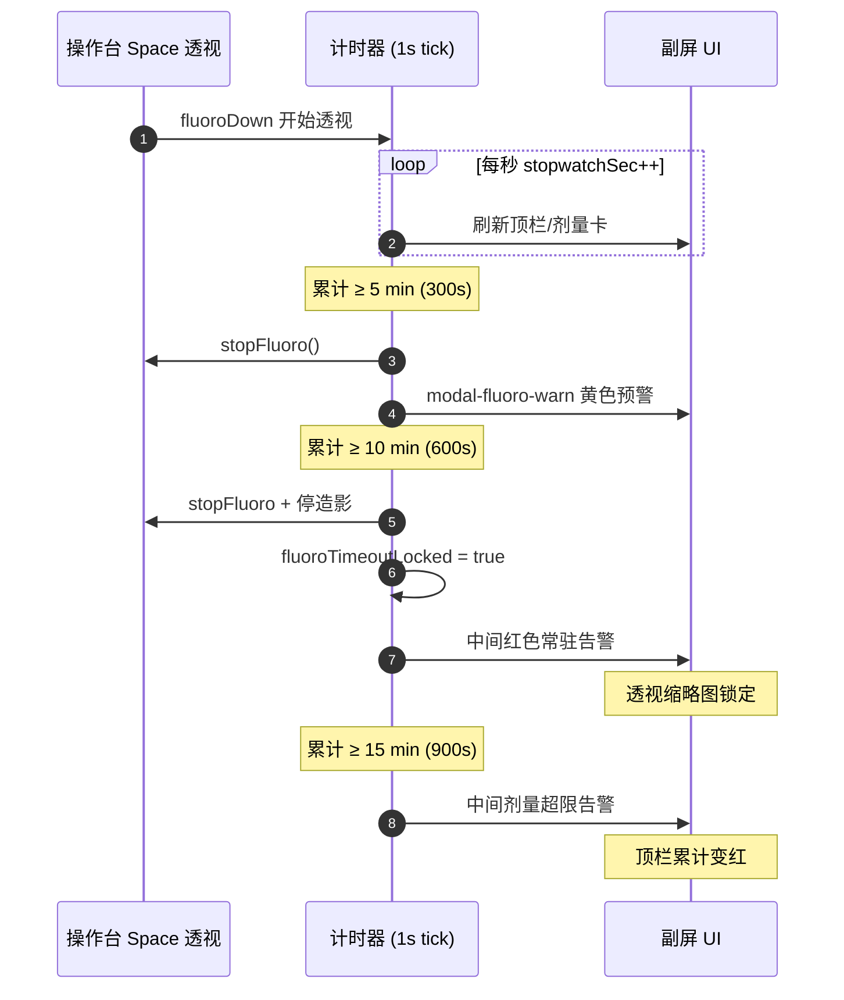
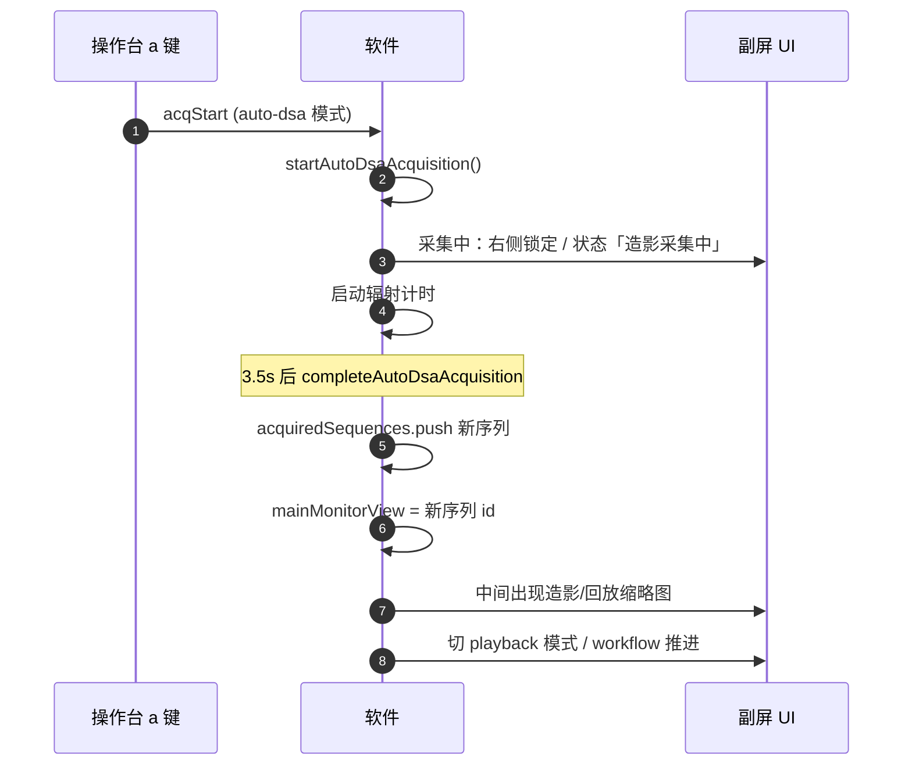
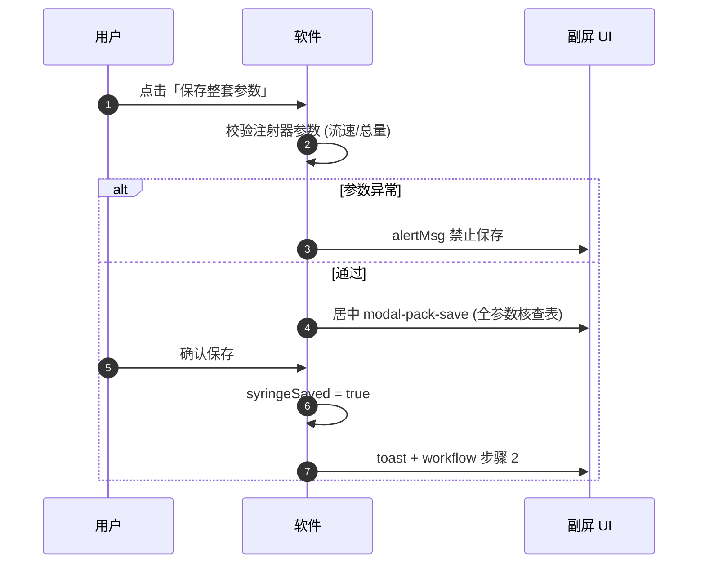

# DSA 床旁副屏 · 功能触发对照表

> **版本**：当前 Demo 实现（`dsa.js` / `index.html`）  
> **定位**：副屏 = 状态总览 + 触屏辅助控制；高清成像输出至主监视器  
> **打印建议**：浏览器打开本文件预览 → 打印；Mermaid 图需支持 Mermaid 的预览器（VS Code、GitHub、Typora 等）

---

## 1. 页面生命周期

| 页面 | 进入条件 | 主要区域 | 退出/下一步 |
|------|----------|----------|-------------|
| **P1 自检** | 页面加载自动开始 | 中间自检进度条 | 7 项完成后自动 → P2 |
| **P2 参数配置** | P1 自检完成 / 底栏「参数配置」 | 采集参数抽屉、后处理抽屉 | 保存整套参数 → 可进 P3 |
| **P3 LiveView** | P2 已保存参数 + 点「进入 LiveView」 | 三栏手术界面 + 序列选择 | 步骤 13 收尾 → P2 后处理 |

---

## 2. 全局布局对照

| 区域 | 页面 | 交互 | 展示内容 |
|------|------|------|----------|
| 顶部状态栏 | P1/P2/P3 | **只读** | CPR、加载、射线、累计辐照、设备、电源、实时剂量、程序、音量 |
| 左栏 | P2/P3 | 部分触屏 | 患者信息、手术阶段、设备联动；P3 加程序模式按钮 + 操作台三组状态 |
| 中间栏 | P3 | 触屏 | ①流程进度 ②序列选择 ③告警 ④剂量汇总 |
| 右栏 | P2/P3 | 触屏 | P3：路图/布局/窗宽窗位/归档/回放 |
| 底栏 | P2/P3 | 部分触屏 | 操作台镜像（只读）+ 剂量明细/告警阈值/操作日志/参数配置 |
| CPR 全局标识 | 全页 | **只读** | CPR 激活时顶部红色胶囊 + 触发时刻 |
| 底栏提示 | P3 | **只读** | 成像在主监视器 / 高风险操作用实体键 |

---

## 3. 键盘模拟操作台（正式环境由硬件驱动）

> 焦点不在 input/textarea/select 时生效

| 按键 | 功能 | 触屏等效 | 主要表现 |
|------|------|----------|----------|
| `Space` 按住 | 透视启停 | —（实体键/脚踏） | 计时累计；顶栏透视 ON；LIVE 缩略图 |
| `Esc` | 全局急停 | — | 停曝光/造影；射线锁止；暂停计时 |
| `c` | CPR 启动 | — | 见 §8 CPR 时序 |
| `p` | 释放患者 | — | 仅 CPR 中有效；不退出 CPR |
| `r` | 射线锁止 | 左栏解锁确认（反向） | 禁止曝光；透视缩略图灰 |
| `u` | 射线解锁请求 | 左栏/中间「解锁确认」 | 弹出二次确认弹窗 |
| `a` | 造影/CBCT 启动 | — | auto-dsa 采集 / CBCT 扫描 |
| `s` | 造影紧急停止 | — | 中断采集；2s 应急锁 |
| `n` | 新建检查 | 左栏「新建检查」 | 清零序列与计时 |
| `m` | 程序模式（操作台） | 左栏大按钮（逻辑不同） | HLC↔常规 / 切回透视 |
| `t` | 床体复位 | 左栏「复位确认」 | CPR 中提示已自动复位 |
| `f` | 故障复位 | — | 见 §9 故障时序 |
| `z` | 计时重置 | 左栏「重置确认」 | 清零累计辐照 |
| `↑` / `↓` | 音量 ±5 | — | HLC 模式无效 |
| `1` | 模拟一般故障 | — | 恒温器异常（黄） |
| `2` | 模拟紧急故障 | — | 电气系统（红） |

---

## 4. 左栏触屏（P3）

| 控件 | 触发 | 顺序 | 表现 |
|------|------|------|------|
| 程序模式大按钮 | 点击 | modeCycle → switchP3Mode 循环 | toast + 顶栏程序更新 |
| 退出 CPR | CPR 激活时 | exitCpr | 关闭抢救态 |
| 解锁确认 | 射线锁止时 | 弹 modal-ray-unlock | 二次确认后解锁 |
| 新建检查 | 点击 | onConsoleKey('newExam') | 重置检查 |
| 床体复位确认 | 点击 | toast 提示实体键 | 不直接执行 |
| 查看详情 | 故障时 | 打开故障弹窗 | — |
| 重置确认 | 点击 | 弹 modal-dose-reset | 剂量清零二次确认 |

**仅展示（无触屏）**：全局急停、CPR 启动、透视启停、造影采集、音量（HLC 灰化）

---

## 5. 中间栏 · 四层结构（P3）

### 5.1 第一层：手术流程进度

| 项目 | 说明 |
|------|------|
| 展示 | 步骤 N/13 + 13 圆点 |
| 配色 | 灰=未执行 / 绿=已完成 / 蓝=当前 |
| 交互 | Hover 显示完整步骤名（只读） |

### 5.2 第二层：影像序列 & 视图快速选择

| 触发 | 顺序 | 表现 |
|------|------|------|
| 点击缩略图 | selectMainMonitorView | 主监视器切换指令；选中高亮（透视=黄框） |
| 上一/下一序列 | sceneSeqStep(±1) | 可选序列间循环 |
| 设为参考目录 | sceneSetRefRoadmap | 保存路图；右侧「参考目录」active |
| 清空叠加 | sceneClearOverlay | silhouetteOff |
| 长按/右键 | sceneThumbMenu | 标记 / 设参考 / 删除序列 |
| 无采集序列 | 自动 | 脑血管示意 + 兜底文案 |

### 5.3 第三层：告警区（优先级覆盖）

| 优先级 | 条件 | 表现 | 触屏 |
|--------|------|------|------|
| 1 | CPR 激活 | 中间「急救进行中」大字 | 退出 CPR |
| 2 | 透视 10min 超时 | 红色常驻告警 | 确认提示 |
| 3 | 剂量 15min 超限 | 红色告警 | 确认 / 清零确认 |
| 4 | 设备故障 | 黄/红告警 | 查看详情 |
| 5 | 射线锁止 | 黄色告警 | 解锁确认 |

### 5.4 第四层：剂量汇总

| 字段 | 刷新 |
|------|------|
| 累计辐照时长 / 实时剂量 / 剩余允许时长 | 发射中每秒更新 |
| 脚注 | 提示底栏「剂量明细」 |

---

## 6. 右栏触屏（P3）

| 分组 | 按钮 | 表现 | 联动 |
|------|------|------|------|
| 路图导航 | 上/下路图、参考目录 | toast 主监视器 | 中间 roadmap 高亮 |
| 视野/布局 | 全屏/双分屏、放大±、镜像、翻转 | toast | — |
| 影像显示 | 窗宽窗位 ±5、降噪、叠加、重置 | toast 主监视器 | — |
| 归档 | 存参考图、存诊断图、图像目录 | workflow 推进 | 中间序列更新 |
| 回放 | 播放/暂停/逐帧 | 主监视器回放 | auto-dsa playback |
| 计时应急 | 强制暂停计时 | 二次确认弹窗 | — |

---

## 7. 底部通栏

| 按钮 | 触发 | 表现 |
|------|------|------|
| 剂量明细 | 点击 | 弹窗：累计/剂量率/阈值进度条 |
| 告警阈值 | 点击 | 5/10/15 分钟规则说明 |
| 操作日志 | 点击 | 列表（含 CPR/故障/硬件信号） |
| 参数配置 | 点击 | 跳转 P2 |
| 操作台镜像芯片 | — | **只读**：急停/CPR/射线/透视/造影/音量/床体/故障 |

---

## 8. CPR 完整时序

| 步骤 | 动作 | 界面表现 |
|------|------|----------|
| 1 | 硬件 CPR 键按下 | 无二次确认，直接启动 |
| 2 | 安全动作 | 停曝光、射线锁止、计时暂停 |
| 3 | 床体自动复位 | 0° CPR 位，写入日志 |
| 4 | 弹窗 | 居中抢救专属（类型/时刻/供电/自动复位） |
| 5 | 全局标识 | 顶部红色 CPR 胶囊 |
| 6 | 退出 | **必须触屏点击**「退出 CPR」 |

---

## 9. 设备故障完整时序

| 故障类型 | 键盘 | 弹窗 | 复位后 |
|----------|------|------|--------|
| 一般（恒温器） | `1` | 黄色，可确认关闭 | 恢复射线 |
| 紧急（电气） | `2` | 红色，不可遮罩关 | 强制 P1 日检 |
| 故障日志 | 弹窗「故障日志」 | 只读列表，不可删除 | — |

---

## 10. 辐射计时自动告警时序

| 阈值 | 时间 | 自动动作 | 界面 |
|------|------|----------|------|
| 预警 | 5 min | 停透视 | 边角黄色弹窗 |
| 强制终止 | 10 min | 停透视/造影；锁定 | 中间红色告警；透视灰 |
| 剂量超限 | 15 min | 记录告警 | 中间红色告警；累计标红 |
| 计时重置 | — | 操作台 `z` / 清零确认弹窗 | 清零累计 |

---

## 11. 自动 DSA 采集时序

---

## 12. P2 保存参数时序

---

## 13. 模式联动总表（打印速查）

| 模式/状态 | 左栏 | 中间序列 | 右栏 | 顶栏 |
|-----------|------|----------|------|------|
| **正常 P3** | 模式可切换 | 全部可用 | 全部可用 | 绿/正常 |
| **HLC 透视** | 音量灰化 | 正常 | 影像可用 | 程序=HLC |
| **射线锁止** | 透视/采集红 | 透视灰，历史可看 | 路图/窗宽可用 | 射线禁止 |
| **CPR** | CPR 可退出 | **全锁定** + 急救告警 | **全灰** | CPR 红 |
| **设备故障** | 新建/模式灰 | 透视受射线规则约束 | 仅查看 | 设备黄/红 |
| **透视 10min 超时** | 计时红 | 透视灰 | 历史可看 | 累计相关 |
| **采集中** | 模式灰 | 展示 | 大部分锁定 | 造影中 |
| **屏幕冻结** | 锁定 | 锁定 | 锁定 | cleanLock |

---

## 14. 弹窗索引

| ID | 名称 | 触发 | 关闭方式 |
|----|------|------|----------|
| modal-pack-save | 保存参数核查 | P2 保存 | 返回修改 / 确认 |
| modal-ray-unlock | 射线解锁 | u / 左栏 / 中间 | 取消 / 确认 |
| modal-dose-reset | 剂量清零 | 左栏/中间 | 取消 / 确认 |
| modal-cpr-active | CPR 抢救专属 | CPR 自动弹出 | 弹窗内按钮；遮罩不可关 |
| modal-device-fault | 设备故障 | 1/2 键自动弹出 | 一般可确认；紧急不可遮罩关 |
| modal-fluoro-warn | 透视 5min | 自动 | 继续 / 知道了 |
| modal-dose-detail | 剂量明细 | 底栏 | 关闭 |
| modal-dose-rules | 告警阈值 | 底栏 | 关闭 |
| modal-list | 日志/目录 | 底栏/右栏 | 关闭 / 选条目 |

---

## 15. 操作台 vs 触屏 分工速查

| 类别 | 操作台实体键 | 触屏副屏 |
|------|-------------|----------|
| **辐射/曝光** | 透视(Space)、造影(a/s)、急停(Esc)、射线锁止(r/u) | 仅状态展示 + 解锁二次确认 |
| **急救** | CPR 启动(c)、释放患者(p) | 退出 CPR、工况确认 |
| **床体** | 摇杆、复位(t) | CPR 自动复位；复位仅确认提示 |
| **故障** | 复位(f) | 查看详情、确认告警(一般)、故障日志 |
| **程序** | 模式(m) | 左栏大按钮 modeCycle |
| **影像后处理** | — | 路图/布局/窗宽窗位/序列切换 |
| **配置/日志** | 音量(↑↓) | 参数配置、剂量明细、操作日志 |

---

*文档生成对应当前代码库 `frontend/dsa/` · 如有功能变更请同步更新本表*
